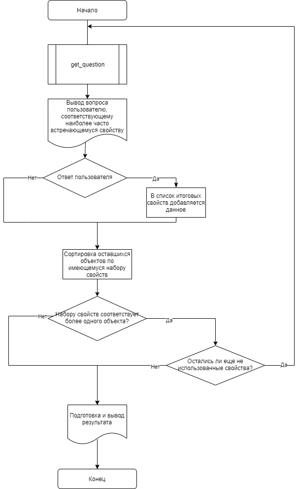
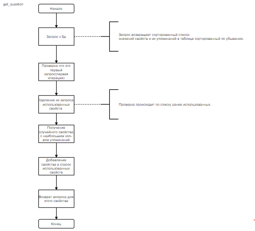

# **Отчет по лаболаторной работе «Проектирование экспертной системы» по дисциплине «Интеллектуальные информационные системы»**

**Выполнил:** студент группы ИБ-С16-1: Рыбанин Е.В.

**Преподаватель:** Пойманова Е.Д.

#### Цель работы: 
Спроектировать и разработать экспертную систему подбора оптимального музыкального стримингового сервиса с пользовательским интерфейсом.

#### Алгоритм работы:

**Рисунок 1** Блок-схема логики работы программы

**Рисунок 2** Блок-схема модуля получения вопроса

